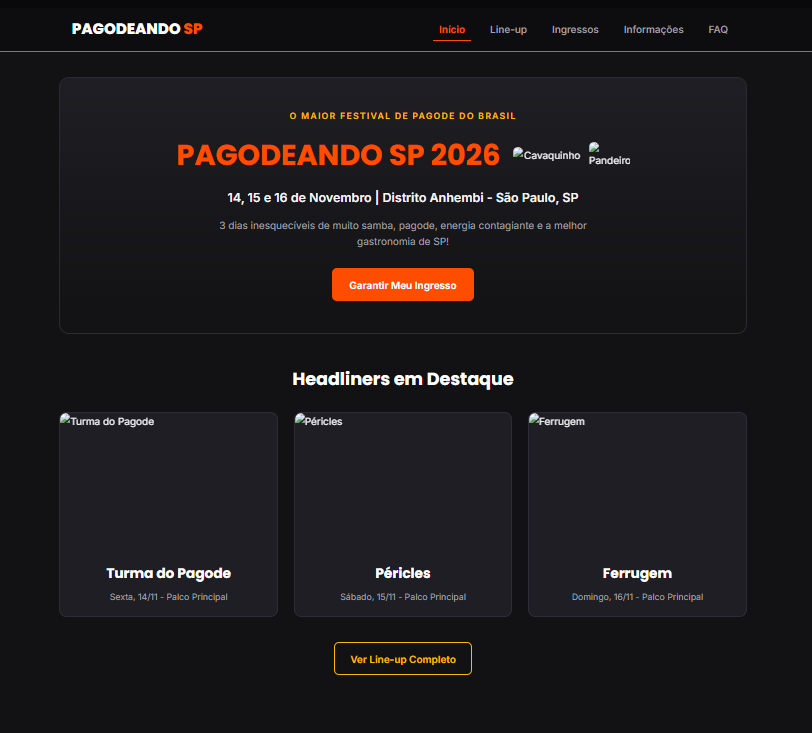
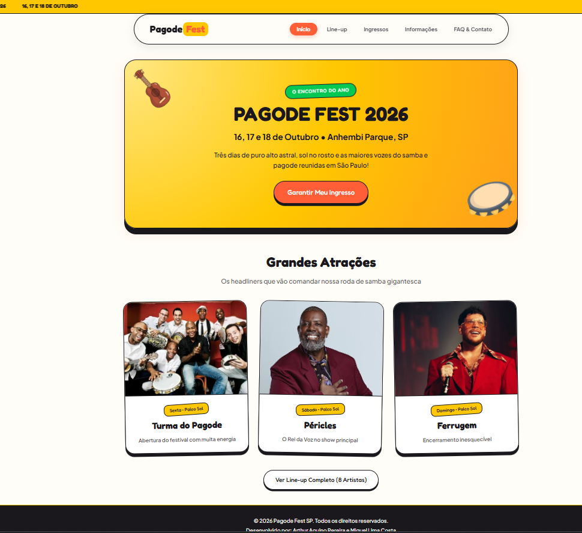

<<<<<<< HEAD
# Pagode Fest SP 2026

**Dupla:** Arthur Aquino Pereira e Miguel Lima Costa
**Site publicado:** https://projeto-ia-lake.vercel.app

## Briefing
* **Público-alvo:** Jovens e adultos (18 a 40 anos) apaixonados por samba de roda, pagode diurno, churrasco com amigos e energia de festival ensolarado ao ar livre.
* **Clima do festival em 3 palavras:** Ensolarado, vibrante e descontraído.
* **Conceito de Design Único:** Visual baseado em adesivos, recortes laterais de ingressos (ticket notches), letreiro em movimento (marquee ticker) e tons quentes de roda de samba.
* **Paleta de Cores:**
  * `#FFC700` (Amarelo Ouro Solar) - Cor principal para energia e calor.
  * `#FF5E36` (Laranja Por do Sol) - Usado em botões, destaques e elementos interativos.
  * `#00C853` (Verde Palmeira) - Detalhes tropicais, badges de destaque e status.
  * `#FFFDF7` (Areia de Praia / Creme) - Fundo quente e iluminado.
  * `#1A181C` (Tinta Grafite) - Contornos marcantes para estilo ilustração.
* **Google Fonts:**
  * **Fredoka (Títulos):** Tipografia arredondada que lembra marcas de verão e rodas de samba.
  * **Plus Jakarta Sans (Textos):** Leitura limpa e moderna para cards e menus.
* **Sites de Inspiração:**
  * *Coachella (Seção Merch/Stickers):* Badges inclinados e selos sobrepostos.
  * *Tardezinha:* Clima ensolarado e tom quente.
  * *Design Neo-brutalista Tropical:* Bordas bem definidas, sombras em bloco e recortes de bilhetes.

## Antes e Depois

## Os 4 prompts que mais fizeram diferença
1. "Crie um estilo visual único para um festival de pagode diurno usando fundo creme quentinho (#FFFDF7), elementos no formato de ingressos destacáveis com recortes laterais e selos no estilo adesivo."
2. "Substitua a estrutura quadrada comum por um layout alegre com uma faixa rotativa em movimento (marquee ticker) anunciando as datas e local no topo."
3. "Desenvolva o CSS de cards de artistas que pareçam cartazes de festival com selos flutuantes inclinados e efeito de elevação dinâmica no hover."
4. "Reestruture o código em 5 páginas HTML distintas com navegação consistente em pílula flutuante e garanta total compatibilidade para publicação na Vercel."
=======
# Pagodeando SP 2026

**Dupla:** Arthur Aquino Pereira e Miguel Lima Costa
**Site publicado:**(https://pagodeando-sp.vercel.app)

## Briefing

* **Público-alvo:** Jovens e adultos de 18 a 45 anos residentes ou visitantes de São Paulo que são apaixonados por samba e pagode, apreciam shows ao vivo, boa gastronomia e momentos de integração festiva.
* **Clima do festival:** Noturno, festivo, elegante e vibrante.
* **Paleta de cores:**
  * `#ff5a2b` (Laranja Pôr do Sol): Usado em destaques principais, botões, bordas do menu e links ativos.
  * `#ffb703` (Amarelo Âmbar): Usado em badges dos palcos, destaques de preços, títulos do FAQ e detalhes secundários.
  * `#131217` (Grafite Fechado): Cor de fundo principal de todas as páginas.
  * `#1d1b26` (Violeta Escuro / Cards): Cor de fundo para os cards de atrações, ingressos, caixas de informação e formulários.
  * `#f3f3f6` (Branco Suave): Cor dos textos principais para garantir máxima leitura e contraste.
* **Fontes do Google Fonts:**
  * **Poppins** (Títulos): Escolhida por ser uma fonte encorpada, marcante e moderna, ideal para dar impacto e clima festivo aos destaques.
  * **Inter** (Textos): Escolhida pela excelente legibilidade em telas de qualquer tamanho, perfeita para a leitura de informações, regras e FAQs.
* **Sites de inspiração:**
  1. [Lollapalooza Brasil](https://www.lollapaloozabr.com/): Inspiração na distribuição clara do Line-up em grid por dias e palcos.
  2. [Tardezinha](https://tardezinha.com.br/): Inspiração na energia visual com cores quentes e vibrantes associadas ao pagode.
  3. [Festival Rock in Rio](https://rockinrio.com/): Inspiração na organização visual das regras e itens permitidos/proibidos.

## Antes e depois

## Os 4 prompts que mais fizeram diferença
1. "Ajuste o cabeçalho e menu de navegação para ficarem fixos no topo, utilizando fundo escuro (#1a1821) e borda inferior em laranja (#ff5a2b) com o indicador .ativa."
2. "Crie a seção do Line-up em um grid responsivo de cards com imagem do artista, garantindo enquadramento no topo com object-position para não cortar os rostos, badge em amarelo (#ffb703) e nome em fonte Poppins."
3. "Estilize o site com um tema escuro sofisticado e alegre, utilizando tons de fundo em grafite/violeta (#131217) com destaques quentes em laranja pôr do sol (#ff5a2b) e amarelo âmbar (#ffb703)."
4. "Na página de informações, crie dois quadros divididos lado a lado com bordas indicativas verde e vermelha para 'O que pode' e 'O que não pode' levar, mantendo o visual limpo e sem emojis."
>>>>>>> 9c4aa51f104d26fc9475ff35bc3b9228ca2e6f00
